# Apex — FPV Payload Dropper

**4 payloads. 1 servo.**

Designed by Yegor Cherov

---

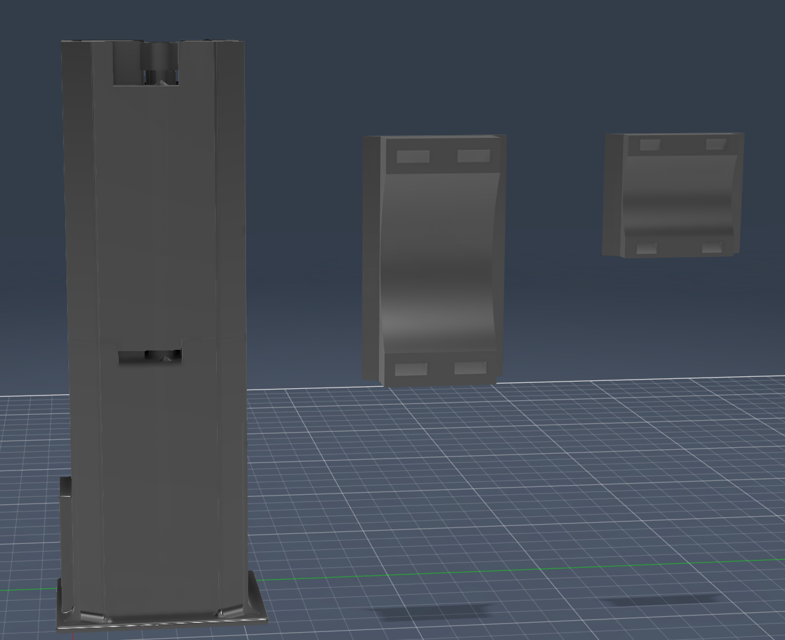

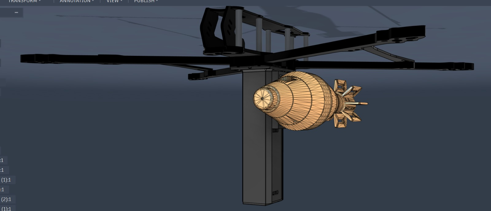

Apex is a 3D printed sequential payload dropper for FPV drones. It drops up to 4 independent payloads at separate times using a single MG996R servo and a 180° sweep. No electronics other than the servo. No additional channels. No extra weight.

It accepts nearly any payload shape or size through a ziptie based holder system, which is what separates it from every other dropper out there. Most designs, including the closest competitor the revolver dropper, lock you into a fixed radius or shape. Apex doesn't care what you're dropping as long as it fits in the holder and you can run a zip tie through it.

https://github.com/YegorCherov/apex/blob/main/docs/images/v1/dropper-video.mp4

> This video shows V1. The current version (V3) is larger, uses an MG996R, and has a single unified arm set.

https://github.com/YegorCherov/apex/blob/main/docs/images/v2/fpv-dropper-video.mp4

> This video shows V2. The current version (V3) is larger and uses an MG996R.


---

## The Problem With Everything Else

Before building Apex, every available 3D printed dropper was evaluated. The main options fall into a few categories:

**Single payload droppers** — simple servo flap or pin release. Works once, then you're done. Useless for multi-drop missions.

**Multi servo droppers** — one servo per payload. Wastes FC channels, adds weight, adds wiring complexity.

**Revolver style droppers** — the most interesting prior art. Spins a cylinder with multiple bays. The fatal flaw: fixed bay radius. You're locked into one payload diameter determined at print time. Change payload size, reprint everything.

None of them solved all the problems at once: universal payload acceptance, multiple sequential drops, single servo, light weight, reliable locking between drops.

---

## How It Works

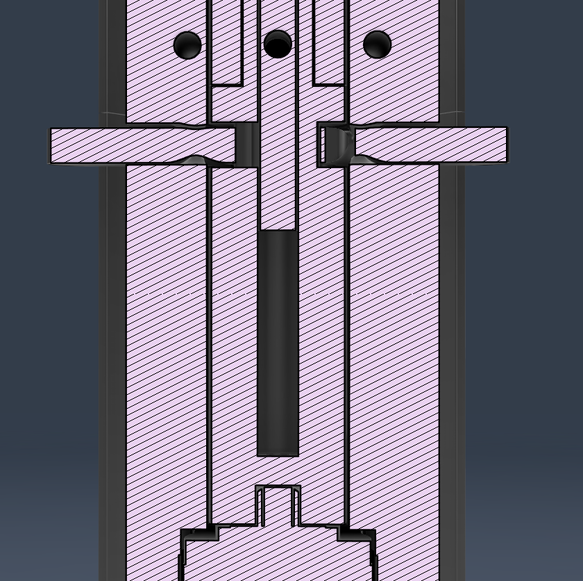

The core idea is sequencing four Geneva mechanisms along a single driven shaft so that one continuous 180° servo rotation trips each one in order, bottom to top.

### The Geneva Mechanism

A Geneva drive converts continuous rotation into indexed, locked steps. The driver has a pin that engages a slotted wheel, rotates it exactly 90°, then disengages. While disengaged, a locking arc on the driver holds the wheel completely stationary. This solves two problems simultaneously: you get a precise 90° rotation to open the arm, and the arm stays locked in both the closed and open positions without any spring or detent.

A regular gear would spin freely the moment the driver moves. A Geneva drive either moves exactly the right amount or doesn't move at all.

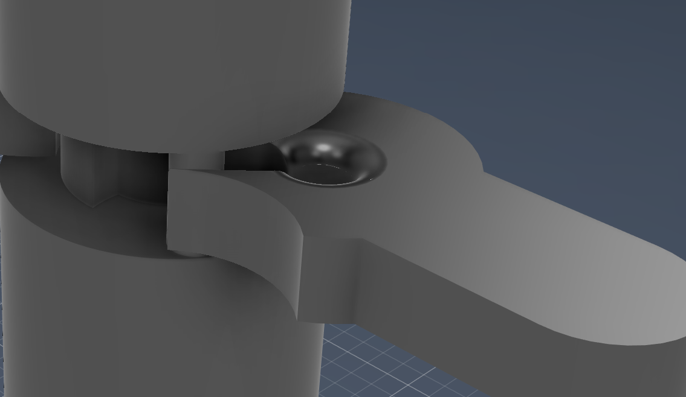

### Sequencing Four Drops in 180°

The shaft carries four engagement pillars. Each pillar is a pin that engages the Geneva slot of one latch arm. The pillars are spaced 35° apart around the shaft.

The sequence across a full 180° sweep:

| Rotation | Event |
|----------|-------|
| 0° | Servo starts, first pillar enters first Geneva slot |
| 35° | First Geneva completes 90° rotation, arm 1 opens, second pillar engages |
| 70° | Arm 2 opens, third pillar engages |
| 105° | Arm 3 opens, fourth pillar engages |
| 140° | Arm 4 opens |
| 180° | Full sweep complete, all 4 payloads dropped |

The arms drop in order from bottom to top. After the sweep, the servo stays at 180° and nothing moves until you command it back for reset.

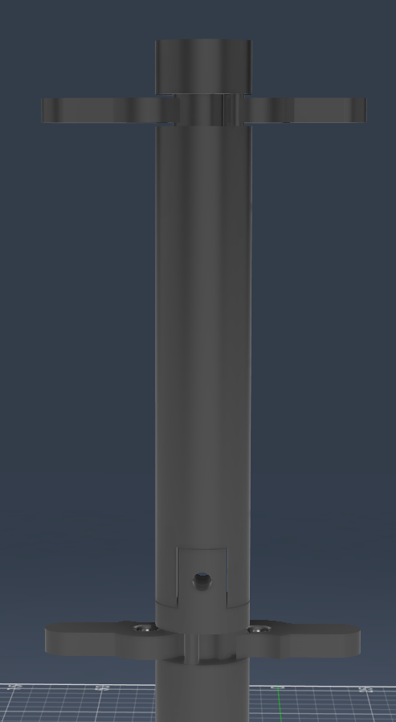

### The Arm Pivot

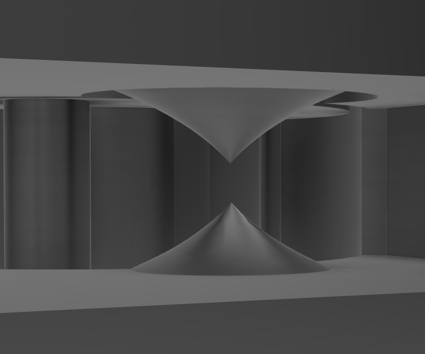
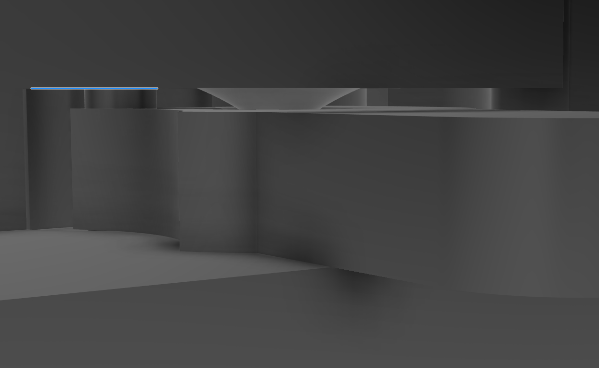

The arms don't rest on cylindrical pins. A cylindrical pin in 3D printed plastic has a tiny contact area and will shear under the load of a payload pulling down. Instead the pivot socket uses a pyramid profile — wider at the base, narrowing to a rounded tip. The arm sits in this cradle from above and below, distributing the load across the full face of the pyramid rather than concentrating it at a line contact. In testing this proved significantly more durable than any pin-based approach.

### The Servo Mount and Shaft

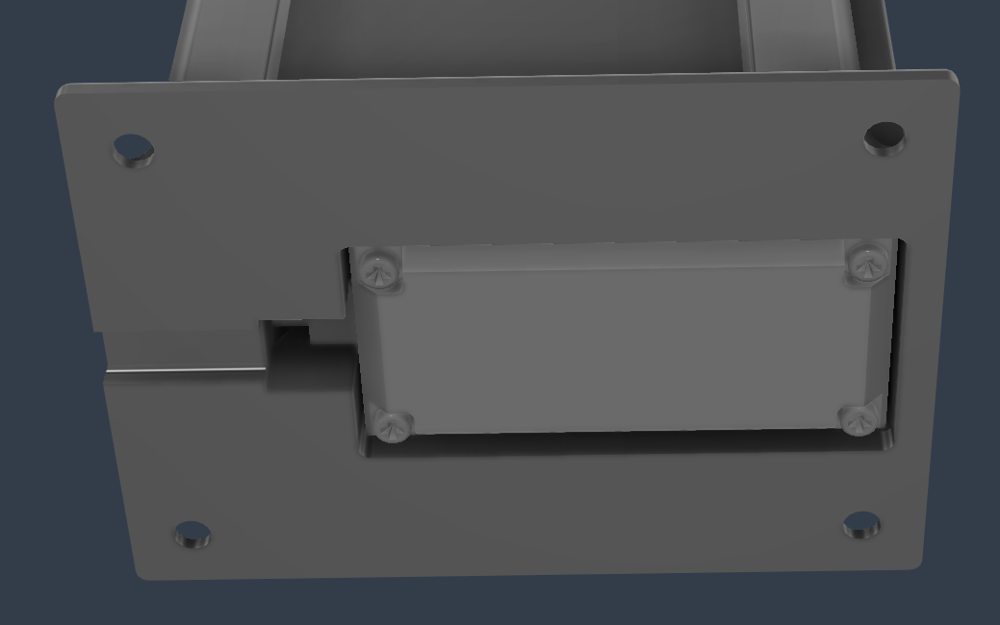

The MG996R sits inside the lower housing. Its horn connects directly to the bottom of the central shaft, which runs the full height of the tube. The shaft is a two-part design (Tube Top and Tube Bot) that assembles around the internal structure. The four engagement pillars are part of the shaft.
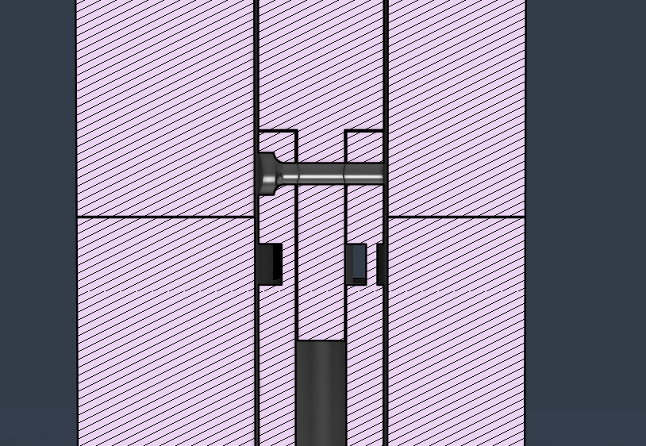
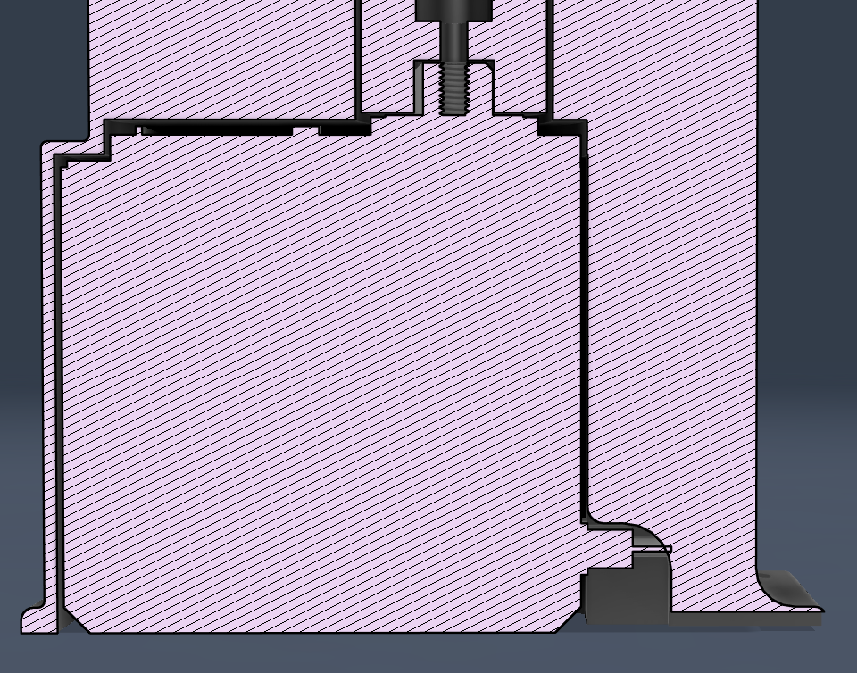

---

## Payload Holders

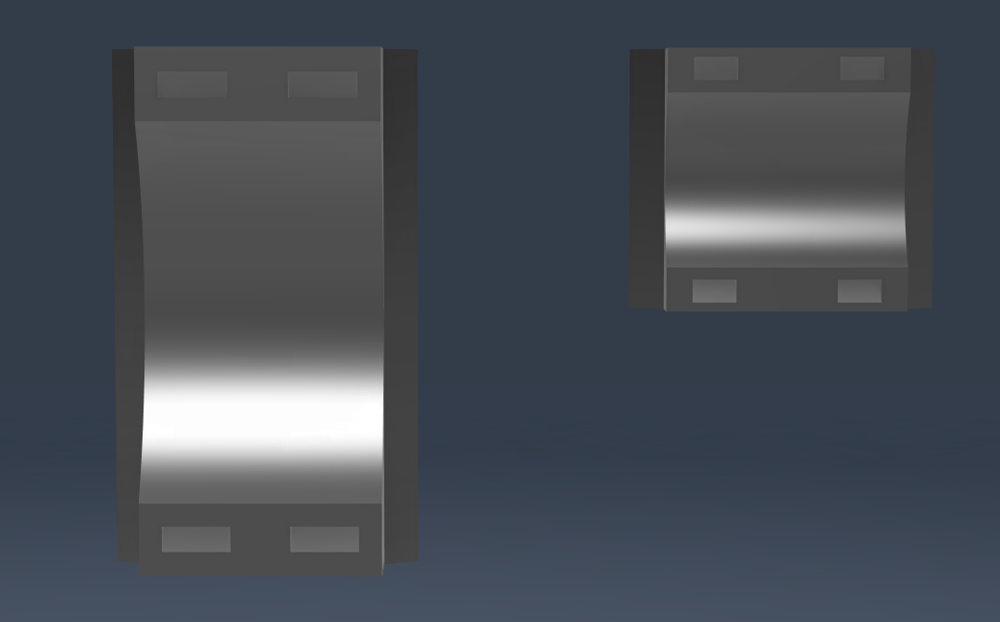

Payloads attach using holders that slide onto the arm. Two sizes are included:

- **S (small)** — the system holds 8 simultaneously
- **M (medium)** — the system holds 4 simultaneously

Each holder has zip tie holes. Run a zip tie through the holes and around your payload. The holder then slides onto the arm and the arm locks it in the closed position. When the Geneva drive opens the arm 90°, the holder slides off and the payload drops.

This is how Apex achieves payload universality. As long as your payload can be ziptied, it works.

---

## Specs

| Parameter | Value |
|-----------|-------|
| Servo | MG996R |
| Operating voltage | 6V (via step-down from drone battery power) |
| Servo travel required | 180° |
| Number of payloads | 4 (M) or 8 (S) |
| Payload attachment | Zip ties |
| Drone compatibility | Any — base plate mounts to 10" frame bolt pattern |
| Drive mechanism | Geneva mechanism × 4 |
| Engagement spacing | about 35° per stage |

---

## Bill of Materials

| Part | Quantity | Notes |
|------|----------|-------|
| MG996R servo | 1 | Must be MG996R or equivalent torque class |
| Step down converter | 1 | Set to 6V output |
| M2 + M3 + M4 screws | assorted | For servo mount and housing assembly |
| Zip ties | 8–16 per mission | For payload attachment |
| PLA or PETG filament | ~65g | PETG recommended for durability |

---

## Print Settings

| Setting | Value |
|---------|-------|
| Layer height | 0.2mm |
| Infill | 40% minimum |
| Infill pattern | Gyroid or honeycomb |
| Material | PETG preferred, PLA works |
| Supports | Required for arm sockets and servo bay |
| Perimeters | 4 minimum |

The pyramid pivot sockets are the most dimensionally critical parts. If your printer runs loose on tolerances, scale the shaft pillars down by 1–2% before printing rather than after.

---

## Wiring and FC Integration


The wiring is straightforward:

1. Connect drone battery to step down converter input
2. Set step down output to 6V
3. Connect MG996R power and ground to step down output
4. Connect MG996R signal wire to a free servo output on the FC

Do not power the MG996R directly from the FC 5V rail. It draws too much current under load and will either brown out the FC or damage the BEC.

### RadioMaster Configuration

On the transmitter, assign a switch or dial to the servo output channel. Configure a custom curve with 5 points:

| Point | Output | Servo Position |
|-------|--------|----------------|
| 1 | –100% | 0° (armed, closed) |
| 2 | –50% | 35° (drop 1) |
| 3 | 0% | 70° (drop 2) |
| 4 | +50% | 105° (drop 3) |
| 5 | +100% | 140°–180° (drop 4) |

Step through the points one at a time during a mission. Each step drops the next payload in sequence.

---

## Assembly


1. Print all parts. Clean up support material carefully around the pivot sockets and Geneva slots.
2. Insert MG996R into the lower servo bay.
3. Slide the bottom tube in, make sure its orientation is correct.
4. Attach the bottom tube piece to the servo using the screw the servo comes with.
5. Attach the top tube piece to the bottom tube piece, slie it in first and then lock it in using an M3 screw.
6. Fit the first two latch arms into their sockets.
7. Attach Shell Addition to Shell Main, Shell Addition should press down on the latch arms, use four M3 screws from both direction.
8. Now add the other two latch arms to the new sockets.
9. Press down the latch arms using the lid and screw it into the Shell Addition using four M3 screws.
10. Mount the base plate to your drone frame using the four bolt holes.
11. Connect wiring as described above.
12. Test the full 180° sweep on the bench before flying.
13. Load payload holders, attach payloads with zip ties, slide holders onto arms, rotate arms to closed position.
14. Have fun!

---

## Mounting

The base plate has four bolt holes sized for a Mark4 V2 10" FPV frame. For other frame sizes, modify the base plate in CAD to match your bolt pattern. The housing itself doesn't need to change, only the base.

---

## Design History

### V1 — Proof of Concept


The first version proved the Geneva sequencing concept worked. It used an SG90 servo and had two distinct sets of arms: a flat set for two Geneva mechanisms and a raised set for the other two, because the geometry didn't allow all four engagement pillars to sit at the same height. It worked but the two arm height approach added print complexity and assembly friction.

The SG90 also immediately revealed itself as inadequate. The printed tolerances weren't perfect, which added friction throughout the mechanism. The SG90 stalled regularly under load. This wasn't fixable by tuning or grease since the servo simply didn't have enough torque for a reliable 4 stage Geneva sequence under any real payload weight.

### V2 — Unified Arms, Same Servo Problem

V2 solved the geometry. By adjusting the pillar spacing and shaft diameter, all four engagement pillars fit at the same height, which meant a single set of arms worked for all four Geneva mechanisms. This simplified the print, reduced part count, and made assembly cleaner.

The SG90 was kept for V2 to isolate the geometry changes. It still stalled. The torque problem was confirmed as the servo, not the mechanism.

### V3 — Final Version

V3 is 20% larger in all dimensions to accommodate the MG996R, which has a substantially larger body than the SG90. The extra size also improved wall thickness throughout the housing and gave more clearance around the Geneva slots, which reduced binding.

The MG996R, running at 6V through a step down converter, has not stalled once. The mechanism runs cleanly through a full 180° sweep under payload weight.

V3 is the version in this repository.

---

## Known Limitations

The base plate bolt pattern is currently sized for a 10" frame. If you're on a different frame size you need to modify the CAD before printing. This is a 5 minute change in Fusion 360 but it does mean you can't just download and print without checking first.

The SG90 will not work reliably. If you can somehow make the SG90 work I'd like to see how.

Payload weight limit hasn't been formally tested. In practice anything you'd drop from an FPV drone is fine, but very heavy payloads (500g+) on a single holder haven't been evaluated.

---

## Files

```
cad/
  v1/         — V1 source files and STLs
  v2/         — V2 source files and STLs
  v3-final/   — V3 final version, print these
firmware/
  radiomaster-config.md

  mechanism-overview.md
  wiring-guide.md
  fc-configuration.md
```

---

## License

MIT License. Use it, modify it, improve it. If you build something better, share it.

---

*Apex — designed and built by Yegor Cherov*